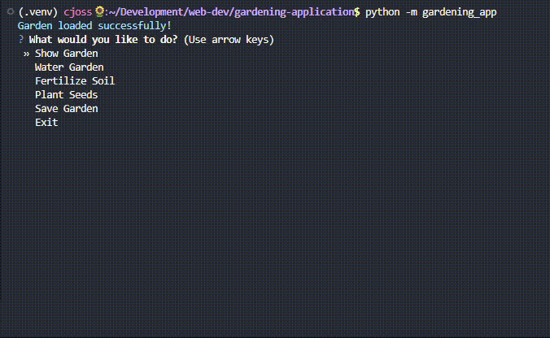

# Gardening App

Create and tend a cozy terminal garden — water, fertilise, plant seeds, and save or load your plants.

This app is a simple, text-based and interactive game that gives the user a sense of control over their garden — encouraging imagination about what that space might look like. It was really enjoyable to design and build the different functions, figuring out how they work together to create an interactive experience.

A virtual environment was used to install the necessary packages and libraries: **Colorama** (to colourise and diversify text) and **Questionary** (to create user-friendly command-line menus navigated with arrow keys).

My intention in creating this style of game or app is to evoke a sense of peace within the user — a garden space that is meditative to navigate and satisfying to participate in.

---

## Quickstart

### 1) (Optional) Create and activate a virtual environment

```bash
# macOS / Linux
python3 -m venv .venv || python -m venv .venv
source .venv/bin/activate

# Windows PowerShell
py -m venv .venv   # or: python -m venv .venv
.\.venv\Scripts\Activate.ps1

# Windows CMD
py -m venv .venv   # or: python -m venv .venv
.\.venv\Scripts\activate.bat
```

### 2) Install dependencies

```bash
# If 'pip' fails, try 'pip3' (macOS/Linux) or 'py -m pip' (Windows)
pip install colorama==0.4.6 questionary==2.0.1 pytest==8.3.3
```

### 3) Run

```bash
# Use the Python you activated above
python -m gardening_app   # or: python3 -m gardening_app | py -m gardening_app (Windows)
```

---

## System Requirements

- Python 3.9 or later (recommended)
- Internet connection (for initial package installation only)
- Terminal or command-line access (Windows PowerShell, macOS Terminal, or Linux Shell)
- Works on Windows, macOS, and Linux

---

## Features

- 🌻 **Show Garden** — Displays all plants currently growing in your garden.
- 💧 **Water Garden** — Keeps plants healthy; shows feedback messages using colour.
- 🌿 **Fertilise Soil** — Boosts growth and shows a readiness message.
- 🌰 **Plant Seeds** — Lets you add “orange tree” or “pumpkin” to your garden.
- 💾 **Save Garden** — Saves your garden’s state to a local JSON file.

<p>
  
</p>

### Future Improvements

- Add a **Pick/Harvest** feature to align with the “ready to be picked” message, allowing users to collect or remove plants from their garden.
- Track harvested items, add growth stages, and display simple ASCII visuals.

---

## Data & Save File

Garden data is stored locally in a file called `garden_data.json`, located in the project’s root directory.

Example `garden_data.json` file:

```json
{
  "plants": ["tomatoes", "snow peas", "marigolds", "nasturtiums", "tulips", "orange tree"]
}
```

- The file is created automatically the first time you save your garden.
- Your garden starts with a default selection of plants, which are written to the file on save.
- Any new plants added during play are saved and automatically reloaded the next time you open the app.

---

## Platform Notes

- If `python` points to Python 2 on your system, use `python3`.
- If you don’t use a virtual environment (venv), you can still install dependencies globally with `pip` (or `pip3`).
- The app runs the same way on Windows, macOS, and Linux once dependencies are installed.

---

## Packages and Dependencies

| Package                    | Purpose                                               | Reason for Use                                                                  |
| -------------------------- | ----------------------------------------------------- | ------------------------------------------------------------------------------- |
| **colorama**               | Adds colour formatting to text output in the terminal | Improves readability and user experience                                        |
| **questionary**            | Provides interactive menus and prompts                | Simplifies command-line input and keeps UX friendly                             |
| **json** (Python built-in) | Reads and writes data to `garden_data.json`           | Enables persistent garden data storage                                          |
| **pytest**                 | Framework for running unit tests                      | Used to verify functions like `is_valid_seed` and ensure the app runs correctly |

---

## How It Works

The app uses two main classes and one entry-point function:

- `Garden` — represents your garden and stores a list of plants.
- `GardenActions` — contains all actions you can perform (watering, fertilising, planting, etc.).
- `main()` — handles the user input loop, connects menu actions, and manages program flow.

Imported Libraries

- `colorama` — adds colour to terminal text (for better readability).
- `questionary` — provides interactive command-line menus for user input.
- `json` — handles saving/loading your garden data.

Together, these components allow the user to interactively manage a persistent virtual garden through simple command-line prompts.

---

## Project Structure

The following outlines the key files included in the Gardening App project.

```text
.
├── README.md                        # Project documentation
├── Feedback/                        # Peer/external and internal review notes
│   ├── 1. Overview.md
│   ├── External-feedback-log.md
│   └── Internal-review.md
├── assets/
│   └── garden_app_preview.gif       # GIF preview of the app
├── gardening_app.py                 # Main program (logic + interactions)
├── test_garden_app.py               # Unit tests for core features
└──  garden_data.json                # Saved garden data (runtime file)
```

---

## Testing

Tests live in `test_garden_app.py`. Activate your virtual environment first (see Quickstart).

### 1) Install pytest (if not already installed)

```bash
pip install pytest
```

### 2) Run the whole test suite

```bash
pytest -q
```

The test suite covers:

- Valid and invalid seed types

```python
def test_is_valid_seed():
    assert is_valid_seed("orange tree")
    assert is_valid_seed("pumpkin")
    assert not is_valid_seed("apple")
    assert not is_valid_seed("")
    print("test_is_valid_seed passed.")
```

- Default garden plant list

```python
def test_garden_initial_plants():
    g = Garden()
    assert "tomatoes" in g.plants
    assert "tulips" in g.plants
    print("test_garden_initial_plants passed.")
```

- Adding new plants to the garden

```python
def test_garden_plant_addition():
    g = Garden()
    g.plants.append("pumpkin")
    assert "pumpkin" in g.plants
    print("test_garden_plant_addition passed.")
```

Useful testing commands:

```bash
# Run with more detail (verbose)
pytest -v

# Run a single test function by name
pytest -q -k test_is_valid_seed

# Stop on first failure
pytest -x

# Show print output (if any) during tests
pytest -s
```

---

## Ethical & Accessibility Considerations

- The app stores data locally only — no internet access or external data sharing.
- Colour output improves usability but may affect accessibility for colour-blind users; future versions could include a “no-colour” mode.
- Uses open-source libraries under approved licenses (see below).

---

## Licences

**COLORAMA LICENSE**

Copyright (c) 2010 Jonathan Hartley
All rights reserved.

Redistribution and use in source and binary forms, with or without
modification, are permitted provided that the following conditions are met:

- Redistributions of source code must retain the above copyright notice, this
  list of conditions and the following disclaimer.
- Redistributions in binary form must reproduce the above copyright notice,
  this list of conditions and the following disclaimer in the documentation
  and/or other materials provided with the distribution.
- Neither the name of the copyright holders, nor those of its contributors
  may be used to endorse or promote products derived from this software without
  specific prior written permission.

THIS SOFTWARE IS PROVIDED BY THE COPYRIGHT HOLDERS AND CONTRIBUTORS "AS IS" AND
ANY EXPRESS OR IMPLIED WARRANTIES, INCLUDING, BUT NOT LIMITED TO, THE IMPLIED
WARRANTIES OF MERCHANTABILITY AND FITNESS FOR A PARTICULAR PURPOSE ARE
DISCLAIMED. IN NO EVENT SHALL THE COPYRIGHT HOLDER OR CONTRIBUTORS BE LIABLE
FOR ANY DIRECT, INDIRECT, INCIDENTAL, SPECIAL, EXEMPLARY, OR CONSEQUENTIAL
DAMAGES (INCLUDING, BUT NOT LIMITED TO, PROCUREMENT OF SUBSTITUTE GOODS OR
SERVICES; LOSS OF USE, DATA, OR PROFITS; OR BUSINESS INTERRUPTION) HOWEVER
CAUSED AND ON ANY THEORY OF LIABILITY, WHETHER IN CONTRACT, STRICT LIABILITY,
OR TORT (INCLUDING NEGLIGENCE OR OTHERWISE) ARISING IN ANY WAY OUT OF THE USE
OF THIS SOFTWARE, EVEN IF ADVISED OF THE POSSIBILITY OF SUCH DAMAGE.

**QUESTIONARY LICENSE**

Copyright 2020 Tom Bocklisch and contributors

Permission is hereby granted, free of charge, to any person obtaining a copy of
this software and associated documentation files (the "Software"), to deal in
the Software without restriction, including without limitation the rights to
use, copy, modify, merge, publish, distribute, sublicense, and/or sell copies
of the Software, and to permit persons to whom the Software is furnished to do
so, subject to the following conditions:

The above copyright notice and this permission notice shall be included in all
copies or substantial portions of the Software.

THE SOFTWARE IS PROVIDED "AS IS", WITHOUT WARRANTY OF ANY KIND, EXPRESS OR
IMPLIED, INCLUDING BUT NOT LIMITED TO THE WARRANTIES OF MERCHANTABILITY,
FITNESS FOR A PARTICULAR PURPOSE AND NONINFRINGEMENT. IN NO EVENT SHALL THE
AUTHORS OR COPYRIGHT HOLDERS BE LIABLE FOR ANY CLAIM, DAMAGES OR OTHER
LIABILITY, WHETHER IN AN ACTION OF CONTRACT, TORT OR OTHERWISE, ARISING FROM,
OUT OF OR IN CONNECTION WITH THE SOFTWARE OR THE USE OR OTHER DEALINGS IN THE
SOFTWARE.

---

## Troubleshooting

- **No colour in output:** Your terminal may not support ANSI colour codes.  
  Try running the app in Command Prompt, PowerShell, or Terminal.
- **Import errors:** Ensure dependencies are installed with  
  `pip install colorama questionary`.
- **Python not found:** Use `python3` or `py` depending on your OS.

---

## Feedback and Reflection

Our team received constructive peer and internal feedback focused on improving readability, structure, and maintainability. The following table summarises key feedback points and realistic, high-impact improvements that would enhance the project’s usability and documentation quality.

### Feedback Summary

| Date        | Reviewer                                 | Feedback Summary                                                                                         | Actionable improvements                                                                                                                                                   |
| ----------- | ---------------------------------------- | -------------------------------------------------------------------------------------------------------- | ------------------------------------------------------------------------------------------------------------------------------------------------------------------------- |
| 24 Oct 2025 | Amelia                                   | Suggested reorganising the README for better flow and clarity.                                           | Reorganise sections for smoother readability (e.g., grouping Features and How It Works). Simplify the licence section by linking externally instead of copying full text. |
| 24 Oct 2025 | Brando                                   | Recommended expanding code comments for clarity and function explanations.                               | Add concise, descriptive docstrings for each class and function; improve inline comments to explain logic and relationships between methods.                              |
| 24 Oct 2025 | Lorena                                   | Advised including an “Ethical & Accessibility Considerations” section.                                   | Keep existing section and expand slightly to mention accessibility improvements such as providing a “no-colour” mode option for users with visual impairments.            |
| 24 Oct 2025 | Tamara                                   | Suggested adding a “Troubleshooting” section for setup issues.                                           | Troubleshooting section added to assist users with common installation and runtime problems.                                                                              |
| 24 Oct 2025 | Internal Review (Zali, Simona, Courtney) | Recommended refining fertiliser message, removing unused helper functions, and improving input handling. | Refine fertiliser text for accuracy, remove the unused `calculate_growth()` helper, and enhance input handling by accepting both “y/n” and “yes/no”.                      |

_For complete peer and internal review notes, see the [`Feedback/`](./Feedback) folder containing external and internal review logs._

### Reflection

This feedback process helped highlight the importance of clear, user-centred documentation and maintainable code. Implementing suggestions such as improving structure, refining comments, and adding troubleshooting support directly improved project readability and user experience. The team also identified further opportunities to strengthen accessibility and input validation, which will be prioritised in future updates.

---

## Contributors

| Role                          | Name                                           | Responsibilities                                    |
| ----------------------------- | ---------------------------------------------- | --------------------------------------------------- |
| **Developer / Project Owner** | Zali ([zalirae](https://github.com/zalirae))   | Original codebase, logic, testing, and feedback log |
| **Documentation Lead**        | Courtney ([c-joss](https://github.com/c-joss)) | README, code comments, documentation review         |
| **Presentation Lead**         | Simona ([ChiSimo](https://github.com/ChiSimo)) | Slides and presentation recording                   |

---

## References

This app runs on Python 3 and uses two key libraries — Colorama and Questionary — to enhance the command-line experience.  
Below are helpful resources for installation and further documentation:

[Installing Python](https://realpython.com/installing-python/)

As well as some documentation on used libraries, Colorama & Questionary:

[COLORAMA install & documentation](https://pypi.org/project/colorama/)

[QUESTIONARY install & documentation](https://pypi.org/project/questionary/)

---

This documentation and accompanying files were developed collaboratively as part of the ISK1001 Industry Skills I Assesment 3 project, demonstrating professional communication and documentation practices.
